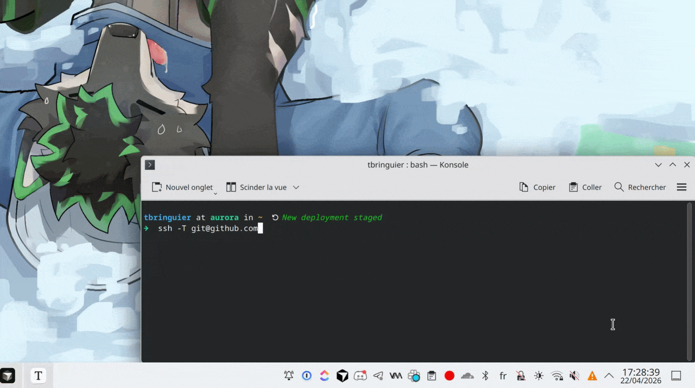

# yubikey-touch-detector

A background service that detects when your YubiKey is waiting for a touch and notifies you via a system-tray icon and/or desktop notifications (libnotify). This is a fork of [maximbaz/yubikey-touch-detector](https://github.com/maximbaz/yubikey-touch-detector) focused on compatibility with atomic Linux desktops, and personal improvements.



---

## Requirements

Those requirements might be installed by default. There is nothing to install on Bazzite, Aurora, Bluefin, for example.

| Requirement | Purpose |
|---|---|
| `libnotify` / `notify-send` | Desktop popup notifications |
| `ykman` | Get (delay) policies installed on YubiKeys |
| udev rule for `/dev/hidraw*` | U2F/FIDO2 touch detection |

### U2F / FIDO2 access

On systems without automatic device access, add a udev rule :

```bash
echo 'SUBSYSTEM=="hidraw", ATTRS{idVendor}=="1050", TAG+="uaccess"' | sudo tee /etc/udev/rules.d/70-yubikey.rules
sudo udevadm control --reload-rules && sudo udevadm trigger
```

Then, re-plug your YubiKey.

### GNOME — AppIndicator extension

The tray icon requires the **AppIndicator** and **KStatusNotifierItem** Support extension. On KDE Plasma no extra setup is needed.

---

## How to Install ?

The `install.sh` script builds the binary inside a `toolbox` container — no packages need to be layered on the host image.

```bash
git clone https://github.com/tbringuier/yubikey-touch-detector
cd yubikey-touch-detector
./install.sh
```

The script will:

1. Build the binary inside a `toolbox` container
2. Install the binary to `~/.local/bin/`
3. Install systemd user units to `~/.config/systemd/user/`
4. Write a default config to `~/.config/yubikey-touch-detector/service.conf`
5. Enable and start the service immediately
6. On subsequent runs, restart the service only if the binary changed

### How to Uninstall ?

```bash
./install.sh --uninstall
```

Your config in `~/.config/yubikey-touch-detector/` is kept — remove it manually if desired:

```bash
rm -rf ~/.config/yubikey-touch-detector
```

---

## Install from binary (any systemd Linux desktop)

<details>
<summary>Expand for manual install instructions</summary>
Download the binary for your architecture from [Releases](../../releases) artifacts, then:

```bash
# 1. Install the binary
sudo install -Dm755 yubikey-touch-detector-linux-amd64 /usr/local/bin/yubikey-touch-detector

# 2. Create config directory and write a minimal config
mkdir -p "${XDG_CONFIG_HOME:-$HOME/.config}/yubikey-touch-detector"
cat > "${XDG_CONFIG_HOME:-$HOME/.config}/yubikey-touch-detector/service.conf" <<'EOF'
YUBIKEY_TOUCH_DETECTOR_LIBNOTIFY=true
YUBIKEY_TOUCH_DETECTOR_TRAY=true
EOF

# 3. Install systemd user units
SYSTEMD_DIR="${HOME}/.config/systemd/user"
mkdir -p "$SYSTEMD_DIR"

cat > "$SYSTEMD_DIR/yubikey-touch-detector.service" <<'EOF'
[Unit]
Description=Detects when your YubiKey is waiting for a touch
Requires=yubikey-touch-detector.socket

[Service]
ExecStart=/usr/local/bin/yubikey-touch-detector
EnvironmentFile=-%E/yubikey-touch-detector/service.conf

[Install]
Also=yubikey-touch-detector.socket
WantedBy=default.target
EOF

cat > "$SYSTEMD_DIR/yubikey-touch-detector.socket" <<'EOF'
[Unit]
Description=Unix socket activation for YubiKey touch detector service

[Socket]
ListenStream=%t/yubikey-touch-detector.socket
RemoveOnStop=yes

[Install]
WantedBy=sockets.target
EOF

# 4. Enable and start
systemctl --user daemon-reload
systemctl --user enable --now yubikey-touch-detector.service
```

**GNOME :** install the AppIndicator extension before starting the service:

```bash
# Fedora / RPM-based
sudo dnf install gnome-shell-extension-appindicator
# Debian / Ubuntu
sudo apt install gnome-shell-extension-appindicator
# Or from https://extensions.gnome.org/extension/615/appindicator-support/
```

Verify the service is running:
```bash
systemctl --user status yubikey-touch-detector.service
journalctl --user -u yubikey-touch-detector.service -f
```

</details>

---

## Configuration

Edit `~/.config/yubikey-touch-detector/service.conf` then restart the service:

```bash
systemctl --user restart yubikey-touch-detector.service
```

| Variable | Default | Description |
|---|---|---|
| `YUBIKEY_TOUCH_DETECTOR_VERBOSE` | `false` | Enable debug logging |
| `YUBIKEY_TOUCH_DETECTOR_LIBNOTIFY` | `true` | Desktop popup (critical urgency, stays until touch) |
| `YUBIKEY_TOUCH_DETECTOR_TRAY` | `true` | System-tray icon (blinks on touch) |
| `YUBIKEY_TOUCH_DETECTOR_STDOUT` | `false` | Print events to stdout |
| `YUBIKEY_TOUCH_DETECTOR_NOSOCKET` | `false` | Disable Unix socket notifier |
| `YUBIKEY_TOUCH_DETECTOR_DBUS` | `false` | Enable D-Bus IPC server |

See [`src/service.conf.example`](src/service.conf.example) for detailed explanations of each option.

---

## Troubleshooting

**Service not starting:**
```bash
journalctl --user -u yubikey-touch-detector.service -b
```

**No notification on touch:**
```bash
yubikey-touch-detector --libnotify --tray -v
# then trigger a gpg/ssh operation and watch the output
# ssh -T git@github.com
```

**Binary not found:**

```bash
echo 'export PATH="$HOME/.local/bin:$PATH"' >> ~/.bashrc && source ~/.bashrc
```

---

## License

[ISC](LICENSE) — same as upstream.

---

> Fork of [github.com/maximbaz/yubikey-touch-detector](https://github.com/maximbaz/yubikey-touch-detector) — Original work by Maxim Baz and contributors.
> This fork have been vibecoded using Claude for personal purposes.
